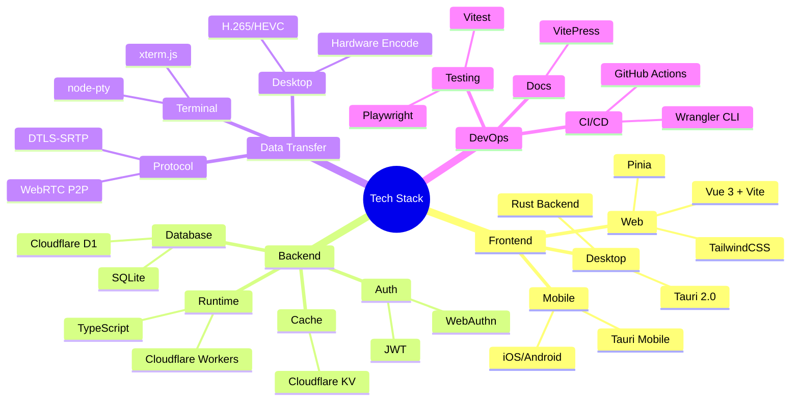
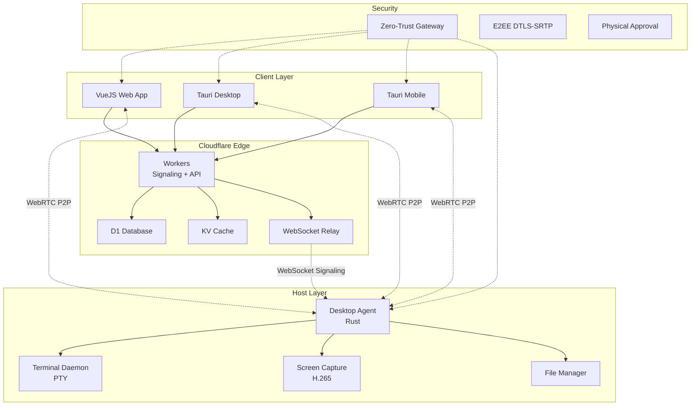
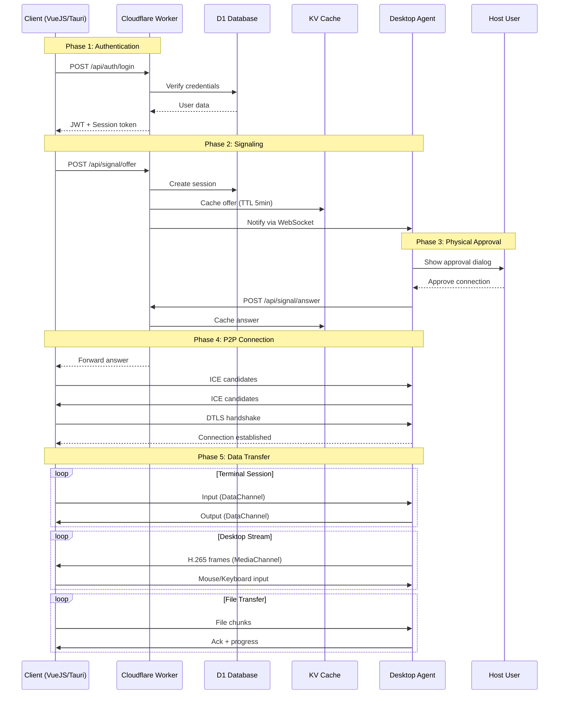
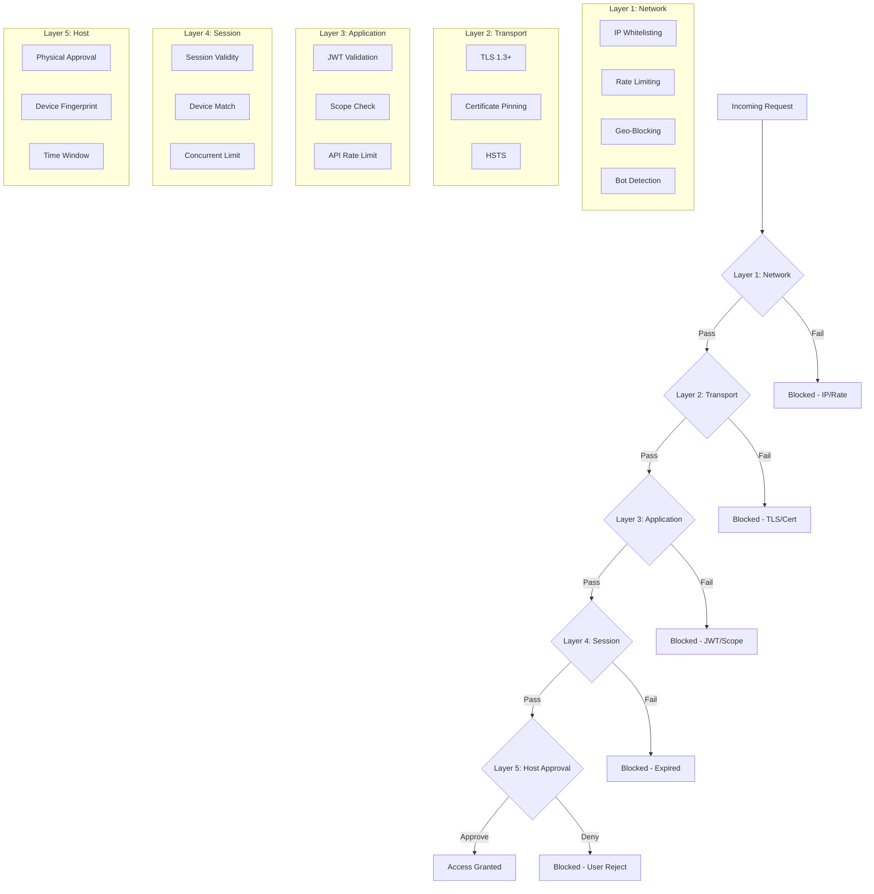
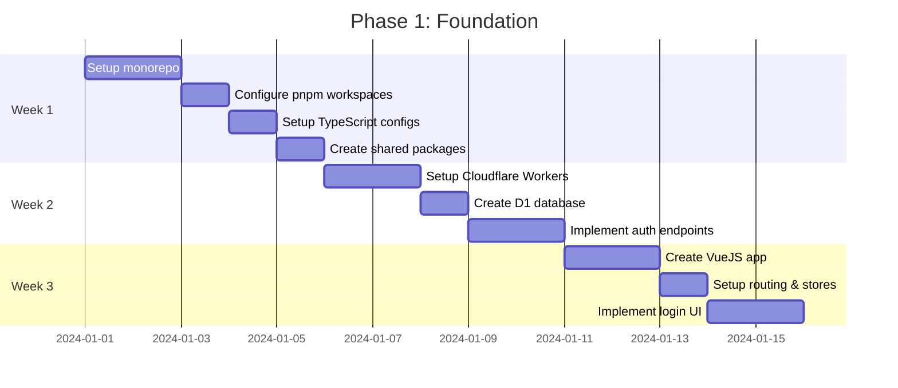

# ARCHITECTURE.md - Remote Access Platform

## 📋 Mục lục

1. [Tổng quan](#1-tổng-quan)
2. [Kiến trúc Hệ thống](#2-kiến-trúc-hệ-thống)
3. [Cấu trúc Monorepo](#3-cấu-trúc-monorepo)
4. [Chi tiết Thành phần](#4-chi-tiết-thành-phần)
5. [Database Schema](#5-database-schema)
6. [API Specification](#6-api-specification)
7. [Bảo mật](#7-bảo-mật)
8. [Lộ trình Triển khai](#8-lộ-trình-triển-khai)
9. [Development Workflow](#9-development-workflow)
10. [Deployment](#10-deployment)

---

## 1. Tổng quan

### 1.1 Mục tiêu

Xây dựng nền tảng remote access toàn diện cung cấp:
- **Remote Terminal** với độ trễ < 10ms
- **Remote Desktop** streaming 60fps
- **Remote File Manager** với transfer tốc độ cao
- **Zero-Trust Security** với end-to-end encryption

### 1.2 Nguyên tắc Thiết kế

| Nguyên tắc | Mô tả |
|-----------|-------|
| **Speed First** | Tối ưu mọi layer cho độ trễ thấp nhất |
| **Security by Default** | Zero-trust, E2EE mọi data channel |
| **Cross-Platform** | Web + Desktop + Mobile từ một codebase |
| **Scalable** | Serverless backend, P2P data transfer |
| **Developer Friendly** | Monorepo, TypeScript-first, clear docs |

### 1.3 Công nghệ Chọn



---

## 2. Kiến trúc Hệ thống

### 2.1 Kiến trúc Tổng thể



### 2.2 Sơ đồ Kết nối



### 2.3 Kiến trúc Bảo mật



---

## 3. Cấu trúc Monorepo

### 3.1 Tổng quan

```
remote-access-platform/
├── .github/
│   └── workflows/
│       ├── ci.yml                    # CI pipeline
│       ├── deploy-workers.yml        # Deploy Cloudflare Workers
│       └── release.yml               # Build & release apps
│
├── apps/                             # Deployable applications
│   ├── web/                          # VueJS Web App
│   │   ├── src/
│   │   │   ├── components/
│   │   │   │   ├── Terminal/
│   │   │   │   │   ├── TerminalView.vue
│   │   │   │   │   ├── TerminalTabs.vue
│   │   │   │   │   └── TerminalSettings.vue
│   │   │   │   ├── Desktop/
│   │   │   │   │   ├── DesktopViewer.vue
│   │   │   │   │   ├── DesktopControls.vue
│   │   │   │   │   └── DesktopToolbar.vue
│   │   │   │   ├── Files/
│   │   │   │   │   ├── FileExplorer.vue
│   │   │   │   │   ├── FileUpload.vue
│   │   │   │   │   ├── FileDownload.vue
│   │   │   │   │   └── FilePreview.vue
│   │   │   │   ├── Connection/
│   │   │   │   │   ├── ConnectionManager.vue
│   │   │   │   │   ├── DeviceApproval.vue
│   │   │   │   │   └── SessionInfo.vue
│   │   │   │   └── Layout/
│   │   │   │       ├── AppHeader.vue
│   │   │   │       ├── AppSidebar.vue
│   │   │   │       └── AppLayout.vue
│   │   │   ├── composables/
│   │   │   │   ├── useWebRTC.ts
│   │   │   │   ├── useTerminal.ts
│   │   │   │   ├── useDesktop.ts
│   │   │   │   ├── useFiles.ts
│   │   │   │   └── useConnection.ts
│   │   │   ├── stores/
│   │   │   │   ├── auth.ts
│   │   │   │   ├── connection.ts
│   │   │   │   ├── terminal.ts
│   │   │   │   └── files.ts
│   │   │   ├── services/
│   │   │   │   ├── api.ts
│   │   │   │   ├── webrtc.ts
│   │   │   │   └── signal.ts
│   │   │   ├── utils/
│   │   │   │   ├── crypto.ts
│   │   │   │   ├── format.ts
│   │   │   │   └── logger.ts
│   │   │   ├── App.vue
│   │   │   └── main.ts
│   │   ├── public/
│   │   ├── package.json
│   │   ├── vite.config.ts
│   │   └── tsconfig.json
│   │
│   ├── desktop/                      # Tauri Desktop App
│   │   ├── src/                      # VueJS frontend (shares web components)
│   │   │   ├── main.ts
│   │   │   └── App.vue
│   │   ├── src-tauri/
│   │   │   ├── src/
│   │   │   │   ├── main.rs
│   │   │   │   ├── lib.rs
│   │   │   │   ├── commands/
│   │   │   │   │   ├── mod.rs
│   │   │   │   │   ├── connection.rs
│   │   │   │   │   ├── terminal.rs
│   │   │   │   │   └── files.rs
│   │   │   │   ├── webrtc/
│   │   │   │   │   ├── mod.rs
│   │   │   │   │   ├── connection.rs
│   │   │   │   │   └── channels.rs
│   │   │   │   └── utils/
│   │   │   │       ├── mod.rs
│   │   │   │       └── logging.rs
│   │   │   ├── Cargo.toml
│   │   │   ├── tauri.conf.json
│   │   │   └── capabilities/
│   │   │       └── default.json
│   │   ├── package.json
│   │   └── vite.config.ts
│   │
│   ├── mobile/                       # Tauri Mobile App (iOS/Android)
│   │   ├── src/                      # VueJS frontend
│   │   ├── src-tauri/
│   │   │   ├── src/
│   │   │   ├── gen/                   # Generated platform code
│   │   │   │   ├── android/
│   │   │   │   └── apple/
│   │   │   ├── Cargo.toml
│   │   │   └── tauri.conf.json
│   │   └── package.json
│   │
│   └── agent/                        # Desktop Agent (Rust)
│       ├── src/
│       │   ├── main.rs
│       │   ├── config.rs
│       │   ├── webrtc/
│       │   │   ├── mod.rs
│       │   │   ├── connection.rs
│       │   │   ├── data_channel.rs
│       │   │   ├── media_channel.rs
│       │   │   └── signal_handler.rs
│       │   ├── terminal/
│       │   │   ├── mod.rs
│       │   │   ├── pty.rs
│       │   │   ├── process_manager.rs
│       │   │   └── session.rs
│       │   ├── capture/
│       │   │   ├── mod.rs
│       │   │   ├── screen.rs
│       │   │   ├── encoder.rs
│       │   │   ├── region.rs
│       │   │   └── input.rs
│       │   ├── files/
│       │   │   ├── mod.rs
│       │   │   ├── manager.rs
│       │   │   ├── transfer.rs
│       │   │   └── watcher.rs
│       │   ├── security/
│       │   │   ├── mod.rs
│       │   │   ├── approval.rs
│       │   │   ├── crypto.rs
│       │   │   └── fingerprint.rs
│       │   └── utils/
│       │       ├── mod.rs
│       │       ├── logging.rs
│       │       └── system.rs
│       ├── Cargo.toml
│       └── agent.toml
│
├── packages/                         # Shared packages
│   ├── shared/                       # Shared types & utilities
│   │   ├── src/
│   │   │   ├── types/
│   │   │   │   ├── index.ts
│   │   │   │   ├── user.ts
│   │   │   │   ├── session.ts
│   │   │   │   ├── webrtc.ts
│   │   │   │   ├── terminal.ts
│   │   │   │   └── files.ts
│   │   │   ├── utils/
│   │   │   │   ├── crypto.ts
│   │   │   │   ├── validation.ts
│   │   │   │   └── helpers.ts
│   │   │   └── index.ts
│   │   ├── package.json
│   │   └── tsconfig.json
│   │
│   ├── api-client/                   # API client for all apps
│   │   ├── src/
│   │   │   ├── client.ts
│   │   │   ├── auth.ts
│   │   │   ├── signaling.ts
│   │   │   ├── sessions.ts
│   │   │   └── index.ts
│   │   ├── package.json
│   │   └── tsconfig.json
│   │
│   ├── webrtc-core/                  # WebRTC abstraction layer
│   │   ├── src/
│   │   │   ├── connection.ts
│   │   │   ├── data-channel.ts
│   │   │   ├── media-channel.ts
│   │   │   ├── signal-handler.ts
│   │   │   └── index.ts
│   │   ├── package.json
│   │   └── tsconfig.json
│   │
│   ├── terminal-core/                # Terminal logic (shared)
│   │   ├── src/
│   │   │   ├── terminal-manager.ts
│   │   │   ├── pty-handler.ts
│   │   │   ├── buffer.ts
│   │   │   └── index.ts
│   │   ├── package.json
│   │   └── tsconfig.json
│   │
│   ├── ui-components/                # Shared Vue components
│   │   ├── src/
│   │   │   ├── components/
│   │   │   │   ├── Terminal/
│   │   │   │   ├── FileBrowser/
│   │   │   │   ├── Connection/
│   │   │   │   └── Common/
│   │   │   ├── composables/
│   │   │   └── index.ts
│   │   ├── package.json
│   │   └── vite.config.ts
│   │
│   └── crypto/                       # Crypto utilities
│       ├── src/
│       │   ├── encrypt.ts
│       │   ├── decrypt.ts
│       │   ├── keys.ts
│       │   └── index.ts
│       ├── package.json
│       └── tsconfig.json
│
├── workers/                          # Cloudflare Workers
│   ├── signaling/                    # Signaling worker
│   │   ├── src/
│   │   │   ├── index.ts
│   │   │   ├── handlers/
│   │   │   │   ├── auth.ts
│   │   │   │   ├── signal.ts
│   │   │   │   ├── session.ts
│   │   │   │   └── device.ts
│   │   │   ├── middleware/
│   │   │   │   ├── cors.ts
│   │   │   │   ├── auth.ts
│   │   │   │   └── rate-limit.ts
│   │   │   ├── db/
│   │   │   │   ├── schema.ts
│   │   │   │   ├── queries.ts
│   │   │   │   └── migrations.ts
│   │   │   └── utils/
│   │   │       ├── jwt.ts
│   │   │       ├── validation.ts
│   │   │       └── helpers.ts
│   │   ├── wrangler.toml
│   │   ├── package.json
│   │   └── tsconfig.json
│   │
│   └── api/                          # Main API worker
│       ├── src/
│       │   ├── index.ts
│       │   ├── routes/
│       │   │   ├── auth.ts
│       │   │   ├── sessions.ts
│       │   │   ├── devices.ts
│       │   │   └── files.ts
│       │   ├── db/
│       │   └── utils/
│       ├── wrangler.toml
│       └── package.json
│
├── docs/                             # Documentation
│   ├── .vitepress/
│   │   └── config.ts
│   ├── api/
│   ├── guides/
│   │   ├── getting-started.md
│   │   ├── installation.md
│   │   ├── configuration.md
│   │   └── troubleshooting.md
│   ├── architecture/
│   │   ├── overview.md
│   │   ├── security.md
│   │   └── webrtc.md
│   └── index.md
│
├── scripts/                          # Build & deploy scripts
│   ├── build-all.sh
│   ├── deploy-workers.sh
│   ├── dev-setup.sh
│   └── generate-keys.sh
│
├── tests/                            # E2E tests
│   ├── e2e/
│   │   ├── terminal.spec.ts
│   │   ├── desktop.spec.ts
│   │   └── files.spec.ts
│   ├── unit/
│   └── integration/
│
├── .gitignore
├── .gitlab-ci.yml                    # If using GitLab
├── ARCHITECTURE.md                   # This file
├── CONTRIBUTING.md
├── README.md
├── package.json                      # Root package.json (workspaces)
├── pnpm-workspace.yaml              # pnpm workspace config
├── turbo.json                       # Turborepo config
└── tsconfig.base.json               # Base TS config
```

### 3.2 Package.json Root

```json
{
  "name": "remote-access-platform",
  "version": "0.1.0",
  "private": true,
  "workspaces": [
    "apps/*",
    "packages/*",
    "workers/*"
  ],
  "scripts": {
    "dev": "turbo run dev",
    "build": "turbo run build",
    "test": "turbo run test",
    "lint": "turbo run lint",
    "typecheck": "turbo run typecheck",
    "dev:web": "pnpm --filter web dev",
    "dev:desktop": "pnpm --filter desktop dev",
    "dev:mobile": "pnpm --filter mobile dev",
    "dev:agent": "cd apps/agent && cargo run",
    "dev:workers": "pnpm --filter signaling wrangler dev",
    "build:all": "turbo run build",
    "deploy:workers": "./scripts/deploy-workers.sh",
    "db:migrate": "wrangler d1 migrations apply signaling --local",
    "db:migrate:prod": "wrangler d1 migrations apply signaling --remote"
  },
  "devDependencies": {
    "@types/node": "^20.0.0",
    "turbo": "^2.0.0",
    "typescript": "^5.4.0",
    "prettier": "^3.2.0",
    "eslint": "^8.57.0"
  },
  "packageManager": "pnpm@9.0.0",
  "engines": {
    "node": ">=20.0.0",
    "pnpm": ">=9.0.0"
  }
}
```

### 3.3 Turborepo Config

```json
{
  "$schema": "https://turbo.build/schema.json",
  "globalDependencies": [".env"],
  "tasks": {
    "build": {
      "dependsOn": ["^build"],
      "outputs": ["dist/**"]
    },
    "dev": {
      "cache": false,
      "persistent": true
    },
    "test": {
      "dependsOn": ["build"],
      "outputs": []
    },
    "lint": {
      "outputs": []
    }
  }
}
```

---

## 4. Chi tiết Thành phần

### 4.1 Web App (VueJS)

**File:** `apps/web/package.json`
```json
{
  "name": "@remote/web",
  "version": "0.1.0",
  "private": true,
  "scripts": {
    "dev": "vite",
    "build": "vue-tsc && vite build",
    "preview": "vite preview",
    "test": "vitest",
    "typecheck": "vue-tsc --noEmit"
  },
  "dependencies": {
    "@remote/shared": "workspace:*",
    "@remote/api-client": "workspace:*",
    "@remote/webrtc-core": "workspace:*",
    "@remote/terminal-core": "workspace:*",
    "@remote/ui-components": "workspace:*",
    "vue": "^3.4.0",
    "vue-router": "^4.3.0",
    "pinia": "^2.1.0",
    "@vueuse/core": "^10.9.0",
    "xterm": "^5.3.0",
    "xterm-addon-fit": "^0.8.0",
    "xterm-addon-webgl": "^0.16.0"
  },
  "devDependencies": {
    "@vitejs/plugin-vue": "^5.0.0",
    "typescript": "^5.4.0",
    "vite": "^5.2.0",
    "vue-tsc": "^2.0.0",
    "vitest": "^1.4.0",
    "tailwindcss": "^3.4.0",
    "autoprefixer": "^10.4.0",
    "postcss": "^8.4.0"
  }
}
```

### 4.2 Desktop Agent (Rust)

**File:** `apps/agent/Cargo.toml`
```toml
[package]
name = "remote-agent"
version = "0.1.0"
edition = "2021"

[dependencies]
# WebRTC
webrtc = "0.10"
tokio = { version = "1.0", features = ["full"] }
tokio-tungstenite = "0.21"

# Terminal
portable-pty = "0.8"
vt100 = "0.15"

# Screen Capture
scrap = "0.5"
x264 = { version = "0.4", optional = true }
openh264 = { version = "0.6", optional = true }

# File System
notify = "6.0"
walkdir = "2.5"

# Crypto
ring = "0.17"
rustls = "0.23"

# Serialization
serde = { version = "1.0", features = ["derive"] }
serde_json = "1.0"
bincode = "1.3"

# Utils
clap = { version = "4.0", features = ["derive"] }
log = "0.4"
env_logger = "0.11"
dirs = "5.0"
sysinfo = "0.30"
uuid = { version = "1.0", features = ["v4"] }
chrono = { version = "0.4", features = ["serde"] }

# Platform-specific
[target.'cfg(target_os = "windows")'.dependencies]
winapi = { version = "0.3", features = ["winuser", "wingdi"] }
windows = { version = "0.54", features = [
    "Graphics_Capture",
    "Graphics_DirectX",
    "Graphics_DirectX_Direct3D11",
] }

[target.'cfg(target_os = "macos")'.dependencies]
screencapturekit = "0.3"
core-graphics = "0.24"

[target.'cfg(target_os = "linux")'.dependencies]
x11 = "2.21"
gstreamer = "0.21"

[features]
default = ["h264"]
h264 = ["dep:x264"]
openh264 = ["dep:openh264"]

[[bin]]
name = "remote-agent"
path = "src/main.rs"
```

### 4.3 Cloudflare Worker

**File:** `workers/signaling/wrangler.toml`
```toml
name = "ponta-remote"
main = "src/index.ts"
compatibility_date = "2024-09-01"
compatibility_flags = ["nodejs_compat"]

[vars]
ENVIRONMENT = "production"
JWT_SECRET = ""
TURN_URL = ""
TURN_USERNAME = ""
TURN_CREDENTIAL = ""

[[d1_databases]]
binding = "DB"
database_name = "remote-access"
database_id = ""

[[kv_namespaces]]
binding = "CACHE"
id = ""

[env.development]
name = "ponta-remote-dev"
vars = { ENVIRONMENT = "development" }

[env.staging]
name = "ponta-remote-staging"

[observability]
enabled = true
```

---

## 5. Database Schema

### 5.1 D1 Migrations

**File:** `workers/signaling/db/migrations/0001_initial.sql`
```sql
-- Users table
CREATE TABLE IF NOT EXISTS users (
    id TEXT PRIMARY KEY DEFAULT (lower(hex(randomblob(16)))),
    username TEXT UNIQUE NOT NULL,
    email TEXT UNIQUE,
    public_key TEXT NOT NULL,
    password_hash TEXT,
    created_at TEXT DEFAULT (datetime('now')),
    updated_at TEXT DEFAULT (datetime('now')),
    last_login_at TEXT,
    is_active BOOLEAN DEFAULT 1,
    metadata TEXT -- JSON
);

-- User devices
CREATE TABLE IF NOT EXISTS devices (
    id TEXT PRIMARY KEY DEFAULT (lower(hex(randomblob(16)))),
    user_id TEXT NOT NULL,
    device_name TEXT,
    device_type TEXT, -- 'desktop', 'mobile', 'web'
    fingerprint TEXT UNIQUE NOT NULL,
    platform TEXT,
    browser TEXT,
    ip_address TEXT,
    approved_at TEXT,
    last_seen_at TEXT,
    is_trusted BOOLEAN DEFAULT 0,
    created_at TEXT DEFAULT (datetime('now')),
    FOREIGN KEY (user_id) REFERENCES users(id) ON DELETE CASCADE
);

-- Sessions
CREATE TABLE IF NOT EXISTS sessions (
    id TEXT PRIMARY KEY,
    user_id TEXT NOT NULL,
    device_id TEXT,
    agent_id TEXT,
    status TEXT DEFAULT 'pending', -- 'pending', 'awaiting_approval', 'active', 'terminated', 'expired'
    created_at TEXT DEFAULT (datetime('now')),
    updated_at TEXT DEFAULT (datetime('now')),
    started_at TEXT,
    ended_at TEXT,
    expires_at TEXT,
    metadata TEXT,
    FOREIGN KEY (user_id) REFERENCES users(id) ON DELETE CASCADE,
    FOREIGN KEY (device_id) REFERENCES devices(id)
);

-- Agents (remote hosts)
CREATE TABLE IF NOT EXISTS agents (
    id TEXT PRIMARY KEY,
    user_id TEXT NOT NULL,
    hostname TEXT,
    platform TEXT,
    os_version TEXT,
    agent_version TEXT,
    public_key TEXT NOT NULL,
    is_online BOOLEAN DEFAULT 0,
    last_heartbeat TEXT,
    capabilities TEXT, -- JSON: ['terminal', 'desktop', 'files']
    created_at TEXT DEFAULT (datetime('now')),
    FOREIGN KEY (user_id) REFERENCES users(id) ON DELETE CASCADE
);

-- WebRTC Signals
CREATE TABLE IF NOT EXISTS signals (
    id TEXT PRIMARY KEY,
    session_id TEXT NOT NULL,
    type TEXT NOT NULL, -- 'offer', 'answer', 'ice-candidate'
    payload TEXT NOT NULL,
    created_at TEXT DEFAULT (datetime('now')),
    expires_at TEXT,
    FOREIGN KEY (session_id) REFERENCES sessions(id) ON DELETE CASCADE
);

-- Connection logs
CREATE TABLE IF NOT EXISTS connection_logs (
    id INTEGER PRIMARY KEY AUTOINCREMENT,
    session_id TEXT,
    user_id TEXT,
    agent_id TEXT,
    event_type TEXT NOT NULL,
    event_data TEXT,
    ip_address TEXT,
    user_agent TEXT,
    created_at TEXT DEFAULT (datetime('now')),
    FOREIGN KEY (session_id) REFERENCES sessions(id),
    FOREIGN KEY (user_id) REFERENCES users(id)
);

-- File transfers
CREATE TABLE IF NOT EXISTS file_transfers (
    id TEXT PRIMARY KEY,
    session_id TEXT NOT NULL,
    user_id TEXT NOT NULL,
    file_name TEXT NOT NULL,
    file_size INTEGER,
    file_hash TEXT,
    direction TEXT, -- 'upload', 'download'
    status TEXT DEFAULT 'pending',
    started_at TEXT,
    completed_at TEXT,
    created_at TEXT DEFAULT (datetime('now')),
    FOREIGN KEY (session_id) REFERENCES sessions(id),
    FOREIGN KEY (user_id) REFERENCES users(id)
);

-- Audit log
CREATE TABLE IF NOT EXISTS audit_logs (
    id INTEGER PRIMARY KEY AUTOINCREMENT,
    user_id TEXT,
    action TEXT NOT NULL,
    resource_type TEXT,
    resource_id TEXT,
    details TEXT,
    ip_address TEXT,
    created_at TEXT DEFAULT (datetime('now')),
    FOREIGN KEY (user_id) REFERENCES users(id)
);

-- Create indexes
CREATE INDEX IF NOT EXISTS idx_users_username ON users(username);
CREATE INDEX IF NOT EXISTS idx_users_email ON users(email);
CREATE INDEX IF NOT EXISTS idx_devices_user_id ON devices(user_id);
CREATE INDEX IF NOT EXISTS idx_devices_fingerprint ON devices(fingerprint);
CREATE INDEX IF NOT EXISTS idx_sessions_user_id ON sessions(user_id);
CREATE INDEX IF NOT EXISTS idx_sessions_status ON sessions(status);
CREATE INDEX IF NOT EXISTS idx_sessions_expires ON sessions(expires_at);
CREATE INDEX IF NOT EXISTS idx_agents_user_id ON agents(user_id);
CREATE INDEX IF NOT EXISTS idx_signals_session_id ON signals(session_id);
CREATE INDEX IF NOT EXISTS idx_signals_expires ON signals(expires_at);
CREATE INDEX IF NOT EXISTS idx_logs_session_id ON connection_logs(session_id);
CREATE INDEX IF NOT EXISTS idx_logs_user_id ON connection_logs(user_id);
CREATE INDEX IF NOT EXISTS idx_audit_user_id ON audit_logs(user_id);
```

---

## 6. API Specification

### 6.1 Authentication Endpoints

```typescript
// packages/shared/src/types/auth.ts
export interface LoginRequest {
  username: string;
  password?: string; // Optional if using WebAuthn
  webauthnCredential?: Credential;
}

export interface LoginResponse {
  token: string;
  refreshToken: string;
  user: User;
  expiresIn: number;
}

export interface RegisterRequest {
  username: string;
  email: string;
  password: string;
  publicKey: string;
}
```

### 6.2 Signaling Endpoints

```typescript
// packages/shared/src/types/signaling.ts
// Wire types cross JSON network boundaries and Cloudflare Workers (which lack DOM libs).
// Conversion to RTCSessionDescriptionInit / RTCIceCandidateInit occurs inside packages/webrtc-core.
export interface SignalOffer {
  sessionId: string;
  sdp: string;
  capabilities: string[];
}

export interface SignalAnswer {
  sessionId: string;
  sdp: string;
  approved: boolean;
}

export interface IceCandidateSignal {
  sessionId: string;
  candidate: string;
  sdpMid: string | null;
  sdpMLineIndex: number | null;
}
```

> **Week 4 Security Boundary Note:** Authentication in Week 4 validates that the session is owned by the calling user. Differentiating the browser client from the desktop agent within the same user's account requires agent-scoped credentials, which are introduced in Week 5 alongside the Rust desktop agent.

### 6.3 REST API Routes

```
# Authentication
POST   /api/auth/register          # Register new user
POST   /api/auth/login             # Login
POST   /api/auth/refresh           # Refresh token
POST   /api/auth/logout            # Logout
POST   /api/auth/webauthn/options  # Get WebAuthn options
POST   /api/auth/webauthn/verify   # Verify WebAuthn

# Agents
GET    /api/agents                 # List user's agents
POST   /api/agents                 # Register new agent
GET    /api/agents/:id             # Get agent details
PUT    /api/agents/:id             # Update agent
DELETE /api/agents/:id             # Remove agent

# Sessions
POST   /api/sessions               # Create new session
GET    /api/sessions               # List sessions
GET    /api/sessions/:id           # Get session details
DELETE /api/sessions/:id           # Terminate session

# Signaling
POST   /api/signal/offer           # Send WebRTC offer
POST   /api/signal/answer          # Send WebRTC answer
POST   /api/signal/ice-candidate   # Send ICE candidate
GET    /api/signal/poll/:sessionId # Poll for signals

# Devices
GET    /api/devices                # List user devices
DELETE /api/devices/:id            # Remove device
PUT    /api/devices/:id/trust      # Mark device as trusted

# Files
GET    /api/files/list             # List files (via API, not P2P)
POST   /api/files/upload-url       # Get presigned upload URL
```

---

## 7. Bảo mật

### 7.1 Zero-Trust Implementation

```typescript
// workers/signaling/src/middleware/auth.ts
import { Context, Next } from 'hono';
import { verifyJWT } from '../utils/jwt';

export async function authMiddleware(c: Context, next: Next) {
  const authHeader = c.req.header('Authorization');
  
  if (!authHeader?.startsWith('Bearer ')) {
    return c.json({ error: 'Missing token' }, 401);
  }
  
  const token = authHeader.slice(7);
  
  try {
    const payload = await verifyJWT(token, c.env.JWT_SECRET);
    
    // Check if user is active
    const user = await c.env.DB.prepare(
      'SELECT * FROM users WHERE id = ? AND is_active = 1'
    ).bind(payload.sub).first();
    
    if (!user) {
      return c.json({ error: 'User not found or inactive' }, 401);
    }
    
    // Add user to context
    c.set('user', user);
    
    await next();
  } catch (error) {
    return c.json({ error: 'Invalid token' }, 401);
  }
}

// Rate limiting
export async function rateLimitMiddleware(c: Context, next: Next) {
  const ip = c.req.header('CF-Connecting-IP');
  const userId = c.get('user')?.id;
  
  const key = `rate:${userId || ip}`;
  const limit = 100; // requests per minute
  const window = 60; // seconds
  
  const current = await c.env.CACHE.get(key);
  const count = current ? parseInt(current) : 0;
  
  if (count >= limit) {
    return c.json({ error: 'Rate limit exceeded' }, 429);
  }
  
  await c.env.CACHE.put(key, String(count + 1), {
    expirationTtl: window
  });
  
  await next();
}
```

### 7.2 E2EE Implementation

```typescript
// packages/crypto/src/encrypt.ts
export class EncryptionManager {
  private keyPair: CryptoKeyPair;
  private sharedKey: CryptoKey;
  
  async initialize(privateKeyJwk: JsonWebKey, peerPublicKeyJwk: JsonWebKey) {
    // Import keys
    const privateKey = await crypto.subtle.importKey(
      'jwk',
      privateKeyJwk,
      { name: 'ECDH', namedCurve: 'P-256' },
      false,
      ['deriveKey']
    );
    
    const peerPublicKey = await crypto.subtle.importKey(
      'jwk',
      peerPublicKeyJwk,
      { name: 'ECDH', namedCurve: 'P-256' },
      false,
      []
    );
    
    // Derive shared key
    this.sharedKey = await crypto.subtle.deriveKey(
      { name: 'ECDH', public: peerPublicKey },
      privateKey,
      { name: 'AES-GCM', length: 256 },
      false,
      ['encrypt', 'decrypt']
    );
  }
  
  async encrypt(data: ArrayBuffer): Promise<ArrayBuffer> {
    const iv = crypto.getRandomValues(new Uint8Array(12));
    
    const encrypted = await crypto.subtle.encrypt(
      { name: 'AES-GCM', iv },
      this.sharedKey,
      data
    );
    
    // Combine IV + encrypted data
    const result = new ArrayBuffer(12 + encrypted.byteLength);
    const view = new Uint8Array(result);
    view.set(iv, 0);
    view.set(new Uint8Array(encrypted), 12);
    
    return result;
  }
  
  async decrypt(data: ArrayBuffer): Promise<ArrayBuffer> {
    const view = new Uint8Array(data);
    const iv = view.slice(0, 12);
    const encrypted = view.slice(12);
    
    return await crypto.subtle.decrypt(
      { name: 'AES-GCM', iv },
      this.sharedKey,
      encrypted
    );
  }
}
```

---

## 8. Lộ trình Triển khai

### Phase 1: Foundation (Tuần 1-3)

**Mục tiêu:** Thiết lập monorepo, infrastructure cơ bản, authentication



#### Tuần 1: Monorepo Setup
- [ ] Khởi tạo pnpm workspace
- [ ] Cấu hình Turborepo
- [ ] Tạo cấu trúc folders
- [ ] Setup TypeScript base config
- [ ] Tạo packages/shared với types
- [ ] Setup ESLint + Prettier
- [ ] Tạo GitHub Actions CI

#### Tuần 2: Backend Foundation
- [ ] Tạo Cloudflare Worker signaling
- [ ] Setup D1 database + migrations
- [ ] Implement JWT authentication
- [ ] Tạo API endpoints cơ bản
- [ ] Setup KV cache
- [ ] Viết unit tests

#### Tuần 3: Frontend Foundation
- [ ] Tạo VueJS app với Vite
- [ ] Setup TailwindCSS + theme
- [ ] Implement routing (vue-router)
- [ ] Tạo auth pages (login/register)
- [ ] Setup Pinia stores
- [ ] Kết nối với API

### Phase 2: WebRTC & Terminal (Tuần 4-6)

**Mục tiêu:** Kết nối WebRTC hoạt động, terminal cơ bản

#### Tuần 4: WebRTC Core
- [ ] Tạo packages/webrtc-core
- [ ] Implement signaling client
- [ ] Xử lý ICE/STUN/TURN
- [ ] Tạo data channels
- [ ] Test kết nối P2P

#### Tuần 5: Desktop Agent - Terminal
- [ ] Tạo Rust agent
- [ ] Implement WebSocket signaling
- [ ] Tích hợp portable-pty
- [ ] Xử lý terminal I/O
- [ ] Implement session management

#### Tuần 6: Terminal UI
- [ ] Tích hợp xterm.js
- [ ] Kết nối data channel với terminal
- [ ] Implement multi-tab terminal
- [ ] Handle resize events
- [ ] Mobile keyboard support

### Phase 3: Desktop Streaming (Tuần 7-9)

**Mục tiêu:** Remote desktop hoạt động với 60fps

#### Tuần 7: Screen Capture
- [ ] Implement screen capture per platform
- [ ] Windows: DXGI Desktop Duplication
- [ ] macOS: ScreenCaptureKit
- [ ] Linux: X11/GStreamer
- [ ] Region of interest tracking

#### Tuần 8: Video Encoding
- [ ] Tích hợp hardware encoder
- [ ] H.264/H.265 encoding
- [ ] Adaptive bitrate control
- [ ] Frame rate management
- [ ] Latency optimization

#### Tuần 9: Desktop Viewer UI
- [ ] Tạo desktop viewer component
- [ ] Implement canvas rendering
- [ ] Handle mouse/keyboard input
- [ ] Multi-monitor support
- [ ] Fullscreen mode

### Phase 4: File Manager (Tuần 10-11)

**Mục tiêu:** File transfer đầy đủ tính năng

#### Tuần 10: File System Core
- [ ] Implement file listing
- [ ] File upload (chunked)
- [ ] File download
- [ ] Resume/pause support
- [ ] Progress tracking

#### Tuần 11: File Manager UI
- [ ] Tạo file explorer component
- [ ] Drag & drop support
- [ ] File preview
- [ ] Search functionality
- [ ] Context menu

### Phase 5: Security & Polish (Tuần 12-14)

**Mục tiêu:** Zero-trust hoàn chỉnh, performance optimization

#### Tuần 12: Security
- [ ] Implement physical approval
- [ ] Device fingerprinting
- [ ] Session revocation
- [ ] Audit logging
- [ ] Rate limiting

#### Tuần 13: Performance
- [ ] Profile & optimize bottlenecks
- [ ] Memory optimization
- [ ] Network optimization
- [ ] Startup time reduction
- [ ] Bundle size optimization

#### Tuần 14: UI/UX Polish
- [ ] Responsive design
- [ ] Dark/light theme
- [ ] Keyboard shortcuts
- [ ] Accessibility
- [ ] Error handling

### Phase 6: Mobile & Release (Tuần 15-16)

**Mục tiêu:** Mobile apps, production release

#### Tuần 15: Tauri Apps
- [ ] Build desktop app (Tauri)
- [ ] Build mobile app (Tauri)
- [ ] Platform-specific optimizations
- [ ] Auto-update mechanism
- [ ] Code signing

#### Tuần 16: Release
- [ ] Documentation hoàn chỉnh
- [ ] E2E tests
- [ ] Security audit
- [ ] Performance benchmarks
- [ ] Production deployment
- [ ] v0.1.0 release

---

## 9. Development Workflow

### 9.1 Local Development

```bash
# Clone repository
git clone https://github.com/yourorg/remote-access-platform.git
cd remote-access-platform

# Install dependencies
pnpm install

# Copy environment files
cp .env.example .env
cp apps/agent/.env.example apps/agent/.env

# Setup database (local)
pnpm db:migrate

# Start development
pnpm dev  # Start all services in parallel

# Or start specific services
pnpm dev:web      # Web app only
pnpm dev:desktop  # Desktop app only
pnpm dev:agent    # Desktop agent only
pnpm dev:workers  # Cloudflare Workers only
```

### 9.2 Environment Variables

**File:** `.env.example`
```env
# Cloudflare
CLOUDFLARE_ACCOUNT_ID=your_account_id
CLOUDFLARE_API_TOKEN=your_api_token

# Database
D1_DATABASE_ID=your_database_id

# JWT
JWT_SECRET=your_jwt_secret_min_32_chars
JWT_EXPIRES_IN=15m
REFRESH_TOKEN_SECRET=your_refresh_secret
REFRESH_TOKEN_EXPIRES_IN=7d

# WebRTC
STUN_SERVER=stun:stun.l.google.com:19302
TURN_URL=turn:your-turn-server.com:3478
TURN_USERNAME=turn_user
TURN_CREDENTIAL=turn_password

# API
API_URL=http://localhost:8787
WS_URL=ws://localhost:8787/ws

# Agent
AGENT_ID=unique_agent_id
AGENT_HOSTNAME=my-computer
AGENT_PORT=9090

# Web App
VITE_API_URL=http://localhost:8787
VITE_WS_URL=ws://localhost:8787/ws
```

### 9.3 Testing Strategy

```bash
# Unit tests
pnpm test

# Specific package tests
pnpm --filter @remote/shared test
pnpm --filter @remote/api-client test

# E2E tests
pnpm test:e2e

# Integration tests
pnpm test:integration
```

### 9.4 CI/CD Pipeline

**File:** `.github/workflows/ci.yml`
```yaml
name: CI

on:
  push:
    branches: [main, develop]
  pull_request:
    branches: [main, develop]

jobs:
  lint:
    runs-on: ubuntu-latest
    steps:
      - uses: actions/checkout@v4
      - uses: pnpm/action-setup@v4
        with:
          version: 9
      - uses: actions/setup-node@v4
        with:
          node-version: '20'
          cache: 'pnpm'
      - run: pnpm install --frozen-lockfile
      - run: pnpm lint
      - run: pnpm typecheck

  test:
    runs-on: ubuntu-latest
    steps:
      - uses: actions/checkout@v4
      - uses: pnpm/action-setup@v4
      - uses: actions/setup-node@v4
      - run: pnpm install --frozen-lockfile
      - run: pnpm test

  build:
    runs-on: ubuntu-latest
    needs: [lint, test]
    steps:
      - uses: actions/checkout@v4
      - uses: pnpm/action-setup@v4
      - uses: actions/setup-node@v4
      - run: pnpm install --frozen-lockfile
      - run: pnpm build
      - uses: actions/upload-artifact@v4
        with:
          name: dist
          path: apps/*/dist

  deploy-workers:
    runs-on: ubuntu-latest
    needs: [build]
    if: github.ref == 'refs/heads/main'
    steps:
      - uses: actions/checkout@v4
      - uses: pnpm/action-setup@v4
      - uses: actions/setup-node@v4
      - run: pnpm install --frozen-lockfile
      - name: Deploy Workers
        run: |
          cd workers/signaling
          npx wrangler deploy
        env:
          CLOUDFLARE_API_TOKEN: ${{ secrets.CLOUDFLARE_API_TOKEN }}
```

---

## 10. Deployment

### 10.1 Cloudflare Workers

```bash
# Deploy signaling worker
cd workers/signaling
npx wrangler deploy

# Run migrations on production
npx wrangler d1 migrations apply signaling --remote

# Check deployment
npx wrangler tail
```

### 10.2 Desktop Agent

```bash
# Build for current platform
cd apps/agent
cargo build --release

# Build for all platforms
cargo build --release --target x86_64-pc-windows-msvc
cargo build --release --target x86_64-apple-darwin
cargo build --release --target aarch64-apple-darwin
cargo build --release --target x86_64-unknown-linux-gnu
```

### 10.3 Desktop/Mobile Apps

```bash
# Build desktop app
cd apps/desktop
pnpm tauri build

# Build mobile apps
cd apps/mobile
pnpm tauri android build
pnpm tauri ios build
```

### 10.4 Docker Deployment

**File:** `apps/agent/Dockerfile`
```dockerfile
FROM rust:latest as builder

WORKDIR /app
COPY . .

RUN cargo build --release

FROM ubuntu:22.04

RUN apt-get update && apt-get install -y \
    ca-certificates \
    && rm -rf /var/lib/apt/lists/*

COPY --from=builder /app/target/release/remote-agent /usr/local/bin/

EXPOSE 9090

CMD ["remote-agent"]
```

---

## 📊 Performance Targets

| Metric | Target | Method |
|--------|--------|--------|
| Terminal Latency | < 10ms | P2P DataChannel |
| Desktop FPS | 60fps | Hardware H.265 |
| File Transfer | > 10MB/s | Parallel chunks |
| Connection Time | < 500ms | 0-RTT QUIC |
| Memory Usage | < 100MB | Optimized agent |
| Bundle Size | < 5MB | Tree-shaking |

---

## 🤝 Contributing

Xem [CONTRIBUTING.md](./CONTRIBUTING.md) để biết hướng dẫn chi tiết.

---

## 📄 License

MIT License - xem [LICENSE](./LICENSE)